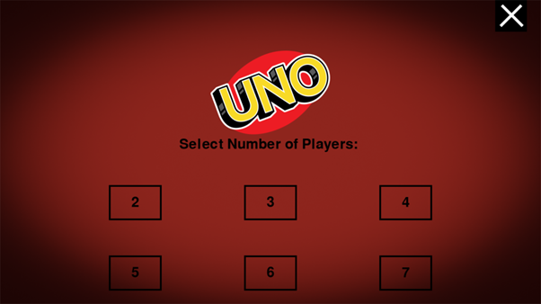

# How to Play

1. To run the game, you must clone the repository to your local system.
2. Now in your terminal head to the location of the `pygame-uno` directory you cloned.
3. Once in this directory, `cd` to `uno-game` and run the main.py file using the conventional `python main.py` command.
4. The game should open to full screen size.

### Sart Screen

    The screen which greets you when you load up the game. AKA the main menu.

### Select Screen

    The next step is to select the number of players in the game (including yourself).

    Make sure you press the play button in the bottom right corner to continue to the game.

### Game

Once in the game, you are met by this screen. Discard pile to the left, Draw to the right and the players spread evenly according to player numbers.
<ol>
<li>To start you have to discard a card from your deck, so click on any card and it will go into the bottom of the discard pile.</li>
<li>Then you will draw a card, and finally move onto playing your usual turn. This will happen each turn.</li>
</ol>

    You have the option of choosing which card you wish to play/can play, after discarding and drawing your cards in the turn.

### Wild Card - Select Colour

    When playing a wild (colour or +4) you get the ability to choose the colour to be played next. Be sure to pick a colour which is in your advantage :).

### Shout Uno

We're nearing the endgame now. Be sure to shout 'UNO' before you play your final card or you will be subject to punishment. Via cards, nothing scary.

### Gameover Screen

    Finally you have finished. This here is the gameover screen when someone has won. Their name and score is displayed and you may wish to play again.

note the screenshots were taken from various games

**Oh and another thing. If you wish to quit at any point during the game, just press the massive [X] in the top right of the screen.**

### **Enjoy your gaming!**